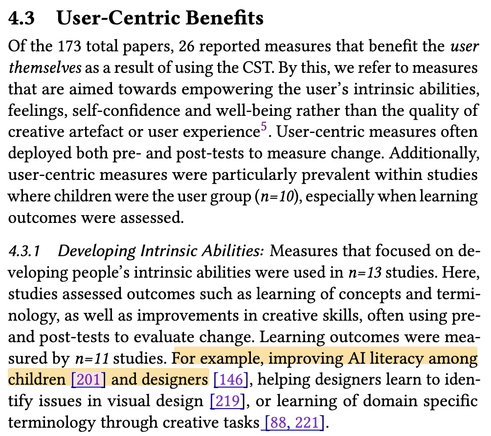

<!-- AI Analysis: rhys2025beyond – 2026-09-10 16:47 -->
<!-- See also: [rhys2025beyond.md](rhys2025beyond.md) -->

# AI Analysis: Beyond Productivity: Rethinking the Impact of Creativity Support Tools

[Full PDF](rhys2025beyond.pdf)

---

## Summary
This paper presents a systematic review of outcome measures used in 173 empirical studies of Creativity Support Tools (CSTs) from the ACM Digital Library (2015–2024). The authors find that while user experience (90%) and creative artefact quality (54%) are frequently measured, user-centric benefits like well-being, self-reflection, and skill development are rarely assessed (15%). They argue for a more holistic approach to CST evaluation that considers benefits to users themselves, not just productivity outcomes.

## Affiliations
Samuel Rhys Cox, Helena Bøjer Djernæs, Niels van Berkel - Department of Computer Science, Aalborg University, Denmark

<Aalborg University>

## Core Contributions
- Systematic categorization of CST outcome measures into three themes: User Experience with CST, Creative Artefact Quality, and User-Centric Benefits
- Identification of a significant gap in research: only 15% of studies measure user-centric benefits (learning, well-being, self-reflection, self-perception)
- Documentation of prevalent reliance on ad hoc measures, particularly for evaluating human-AI collaboration in CSTs
- Call for validated measures specifically suited to evaluating generative AI in creativity contexts
- Comprehensive mapping of 173 papers across measure types, venues, and years (2015-2024)

## Methodology
- **Scope:** 10-year review (2015-2024) of ACM Digital Library publications
- **Search Strategy:** Searched "creativity support tool" anywhere in publication + "creativity" as keyword
- **Initial Results:** 1,241 papers screened down to 173 included papers
- **Analysis:** Two researchers conducted thematic analysis using open coding to extract outcome measures
- **Inclusion Criteria:** Empirical evaluations of user interactions with CSTs, including human-AI co-creativity tools
- **Exclusion Criteria:** Formative work, fully automated systems, taxonomy development, observational-only studies, insufficient measure descriptions

## Key Findings
- **User Experience (90% of studies):** General usability measures dominated (n=101), with SUS (n=20) and CSI (n=50) being common validated scales; many ad hoc measures used
- **Creative Artefact Quality (54%):** Well-established measures from creativity literature (fluency, flexibility, originality, elaboration from TTCT); human ratings and quantitative content analysis
- **User-Centric Benefits (15%):** Included intrinsic abilities (n=13), emotional well-being (n=6), self-reflection (n=6), self-perception (n=5); often used pre/post-test designs
- **Generative AI Gap:** Studies evaluating human-AI collaboration increasingly rely on ad hoc measures, indicating need for validated scales addressing ownership, agency, and collaboration dynamics
- **Publication Trends:** CHI (n=55), C&C (n=28), DIS (n=16), UIST (n=16) were top venues

## Limitations & Future Work
**Limitations:**
- Review limited to ACM Digital Library only; other repositories (IEEE Xplore, Science Direct) may contain additional measures
- Definition of CST varies across literature; authors chose to include co-creative AI systems
- Exploratory studies excluded, which may contain user-centric measures not captured

**Future Directions:**
- Development of validated measures for human-AI co-creativity experiences
- Greater emphasis on longitudinal studies to assess behavior change and well-being outcomes
- Integration of measures from conversational user interface (CUI) research
- Adoption of user-centric outcomes informed by health/arts research (citing Fancourt & Finn's WHO scoping review)

## Connection to User Notes
The user's notes are empty—no key points, relevance, or personal annotations were provided. The paper would be relevant to researchers interested in: (1) methodology for evaluating creative AI tools, (2) human-AI collaboration in creative contexts, (3) well-being and personal benefits of creative technology use, or (4) systematic review methodology in HCI.

## Related Work Cited
- **Frich et al. (2019)** - "Mapping the Landscape of Creativity Support Tools in HCI" - foundational CST review covering methodological approaches
- **Cherry & Latulipe (2014)** - Creativity Support Index (CSI) - most widely adopted validated measure for creativity support evaluation
- **Fancourt & Finn (2019)** - WHO scoping review on arts and health/well-being - provides foundation for user-centric benefits
- **Remy et al. (2020)** - Prior review of CST evaluation methodologies (differentiated from current work's focus on outcome measures)
- **Lawton et al. (2023)** - Mixed-Initiative Creativity Support Index (MICSI) - extends CSI for human-AI co-creation contexts

---

## Screenshots

---
_Generated 2026-09-10 by Claude (model: claude-opus-4-5)_
